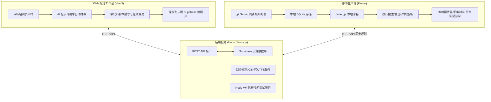

# FluxForge 跨端生态架构与规则契约白皮书

> 本文档为 FluxForge 跨端系统（Web 管理台、Server 服务端、Flutter 移动端）的统一架构规范与核心契约标准，用于指导多端开发、规则解析引擎对齐、数据模型统一以及后续移动端重构演进。

---

## 目录
- [一、 系统整体拓扑与工程组织](#一-系统整体拓扑与工程组织)
- [二、 统一规则沙箱规范 (Single `code` Contract)](#二-统一规则沙箱规范-single-code-contract)
  - [2.1 架构演进与单代码原则](#21-架构演进与单代码原则)
  - [2.2 沙箱上下文契约 (Context Schema)](#22-沙箱上下文契约-context-schema)
  - [2.3 四大核心生命周期契约](#23-四大核心生命周期契约)
  - [2.4 运行环境与内置依赖库](#24-运行环境与内置依赖库)
- [三、 数据模型规范与字段对齐](#三-数据模型规范与字段对齐)
  - [3.1 规则实体模型 (`Rule`)](#31-规则实体模型-rule)
  - [3.2 搜索与发现结果模型 (`SearchResult` / `DiscoveryResult`)](#32-搜索与发现结果模型-searchresult--discoveryresult)
  - [3.3 详情与选集播放模型 (`DetailResult`)](#33-详情与选集播放模型-detailresult)
  - [3.4 Flutter 模型重构对照表 (废弃与演进)](#34-flutter-模型重构对照表-废弃与演进)
- [四、 服务端 API 通信契约](#四-服务端-api-通信契约)
  - [4.1 规则 CRUD 接口](#41-规则-crud-接口)
  - [4.2 沙箱远程调试接口](#42-沙箱远程调试接口)
  - [4.3 网页探测与自动编码转译接口](#43-网页探测与自动编码转译接口)
- [五、 Flutter 客户端运行机制与适配规范](#五-flutter-客户端运行机制与适配规范)
  - [5.1 本地规则运行流水线 (`RuleEngine`)](#51-本地规则运行流水线-ruleengine)
  - [5.2 语法转译机制 (ESM to Function)](#52-语法转译机制-esm-to-function)
  - [5.3 数据缓存与离线策略](#53-数据缓存与离线策略)
- [六、 移动端重构行动指南与路线图](#六-移动端重构行动指南与路线图)

---

## 一、 系统整体拓扑与工程组织

项目采用扁平化多端大仓（Flat Multi-System Monorepo）模式统一管理：

```text
fluxforge/
├── app/                  # [Flutter] 移动客户端 (iOS / Android / Desktop)
│   ├── lib/              # Dart 源码 (UI、页面、本地 JS 规则引擎)
│   ├── assets/js/        # 本地内置沙箱依赖 (axios.min.js, cheerio.js)
│   └── pubspec.yaml      # Flutter 依赖配置
├── server/               # [Node.js / Hono] 后端 API 微服务与云端执行沙箱
│   ├── src/db/           # Supabase 持久化数据访问层
│   ├── src/services/     # 沙箱执行器 (Node VM)、页面转译爬虫
│   └── src/routes/       # RESTful API 路由 (/api/rules)
├── web/                  # [Vue 3 / Vite] 现代规则工作台与管理中台
│   ├── src/views/rules/  # 规则编排、数据采样、AI 生成与诊断工作台
│   ├── src/stores/       # 多 Profile AI 配置中心、规则状态管理
│   └── src/components/   # 播放器 (ArtPlayer)、Monaco 代码编辑器等
├── api/                  # [Vercel Serverless] 生产环境云函数反向代理
├── docs/                 # 跨端架构白皮书与技术规范文档
├── package.json          # 根级 Node 工作区配置
└── vite.config.ts        # 全栈开发与部署构建配置
```

### 协作流转架构



---

## 二、 统一规则沙箱规范 (Single `code` Contract)

### 2.1 架构演进与单代码原则
在早期的规则设计中，规则被拆散为多个独立的碎片代码片段（如 `discoveryCode`、`searchCode`、`detailCode`）。这种模式存在明显的缺陷：
* **割裂上下文**：公用的解析选择器、加密/解密函数、请求工具头无法跨生命周期复用；
* **维护成本翻倍**：每次更新源站防爬或选择器需要分别修改 3~4 个代码块；
* **AI 生成困难**：LLM 很难一次性精准生成 3 个相互关联但格式分离的脚本。

**【现行强制标准】**：系统**彻底统一为单一 `code` 脚本沙箱模式**。
每个规则包含且仅包含一个完整的 JavaScript 脚本，脚本通过接收 `context.action` 参数分发执行相应的生命周期逻辑。

### 2.2 沙箱上下文契约 (Context Schema)

沙箱在调用脚本时，必须传入包含以下字段的上下文对象：

```typescript
export interface RuleContext {
  action: 'discovery' | 'search' | 'detail' | 'parse'; // 执行的生命周期
  params: {
    keyword?: string;     // 搜索关键词 (action === 'search' 时必填)
    page?: number;        // 分页页码，从 1 开始计数 (默认 1)
    category?: string;    // 分类/标签标识 (用于 discovery)
    url?: string;         // 目标详情页或直链 URL (detail / parse 时传入)
    episodeId?: string;   // 选集 ID 或附加标识
    extra?: Record<string, any>; // 透传的自定义扩展载荷
    baseUrl?: string;     // 当前源站的基础 URL (如 https://example.com)
  };
}
```

### 2.3 四大核心生命周期契约

规则脚本的标准结构导出单一入口函数（支持 `export default` 或自执行闭包）：

```javascript
import axios from 'axios';
import * as cheerio from 'cheerio';

export default async function(context) {
  const { action, params } = context;

  switch (action) {
    case 'discovery':
      return await handleDiscovery(params);
    case 'search':
      return await handleSearch(params);
    case 'detail':
      return await handleDetail(params);
    case 'parse':
      return await handleParse(params);
    default:
      throw new Error(`Unsupported action: ${action}`);
  }
}
```

#### ① `discovery`（分类发现与首页瀑布流）
* **入参**：`params: { page: number, category?: string, baseUrl: string }`
* **返回值规范**：
  ```typescript
  interface DiscoveryResponse {
    list: Array<{
      title: string;       // 标题
      cover: string;       // 封面图绝对 URL
      url: string;         // 详情页相对路径或绝对 URL
      description?: string;// 简要描述/更新状态 (如 "更新至第12集")
      type?: string;       // 媒体子类型 (movie/tv/comic/photo/novel)
      tag?: string[];      // 标签 (如 ["都市", "热血"])
    }>;
    hasMore: boolean;      // 是否还有下一页
    total?: number;        // 总条目数 (可选)
  }
  ```

#### ② `search`（全局关键词检索）
* **入参**：`params: { keyword: string, page: number, baseUrl: string }`
* **返回值**：与 `DiscoveryResponse` 结构完全一致，保证客户端 UI 列表组件可 100% 复用。

#### ③ `detail`（详情元数据与选集解析）
* **入参**：`params: { url: string, baseUrl: string }`
* **返回值规范**：
  ```typescript
  interface DetailResponse {
    title: string;          // 媒体全称标题
    cover: string;          // 高清封面图
    description?: string;   // 剧情简介 / 图集说明 / 小说梗概
    type: 'movie' | 'tv' | 'photo' | 'manga' | 'novel'; // 核心媒体类型
    author?: string;        // 导演 / 作者 / 创作者
    status?: string;        // 完结状态 (连载中 / 已完结)
    tags?: string[];        // 题材分类标签
    // 选集/章节/线路列表 (支持多播放线路)
    episodes?: Array<{
      name: string;         // 剧集/章节名称 (如 "第01集", "第一话")
      url: string;          // 目标播放页或正文相对/绝对 URL
      playUrl?: string;     // 若已直接获得直链，可直接提供
    }>;
    // 多线路扩展支持 (可选)
    sources?: Array<{
      sourceName: string;   // 线路名称 (如 "官方4K", "极速备用")
      episodes: Array<{ name: string; url: string; playUrl?: string }>;
    }>;
    // 图片集专有支持 (图集类型)
    images?: string[];      // 高清大图 URL 数组
  }
  ```

#### ④ `parse`（播放嗅探与免嗅解析）
* **入参**：`params: { url: string, episodeId?: string, baseUrl: string }`
* **返回值规范**：
  ```typescript
  interface ParseResponse {
    playUrl: string;        // 最终的音视频直链 (mp4, m3u8, flv 等)
    headers?: Record<string, string>; // 播放请求头 (防盗链 Referer, User-Agent 等)
    format?: 'm3u8' | 'mp4' | 'flv' | 'hls'; // 媒体封装格式
  }
  ```

### 2.4 运行环境与内置依赖库

不管是 Server 端的 Node.js 沙箱环境，还是 App 端的 `flutter_js` 引擎，**必须且仅提供以下通用基础依赖**：

| 依赖标识 | 版本/特性说明 | 在沙箱中的可用全局变量 |
| :--- | :--- | :--- |
| **`axios`** | HTTP 请求库，支持 GET/POST，内置防爬 User-Agent | `axios`, `require('axios')` |
| **`cheerio`** | 类似 jQuery 的高性能 HTML DOM 解析库 | `cheerio`, `require('cheerio')` |
| **`iconv`** | 字符集编码解码（GBK, GB2312 转 UTF-8） | `iconv-lite`, `iconv` |
| **`crypto`** | 散列计算（MD5, SHA256, AES）解密播放直链 | `crypto`, `require('crypto')` |

---

## 三、 数据模型规范与字段对齐

### 3.1 规则实体模型 (`Rule`)

在数据库及多端之间传输的标准 JSON 契约：

```json
{
  "id": 101,
  "name": "某某影视站",
  "type": "video",
  "baseUrl": "https://api.example.com",
  "code": "import axios from 'axios'...",
  "description": "提供高清影视在线点播与搜索",
  "version": "1.0.0",
  "author": "Admin",
  "enabled": 1,
  "created_at": "2026-09-07T08:00:00.000Z",
  "updated_at": "2026-09-07T08:30:00.000Z"
}
```

### 3.2 Flutter 模型重构对照表 (废弃与演进)

现有 Flutter 代码（位于 `app/lib/model/`）存在部分历史废弃字段，需严格按照下表进行收敛与重构：

| 原 Flutter 字段 (`lib/model/rule.dart`) | 现行标准契约字段 | 状态 | 说明与重构动作 |
| :--- | :--- | :--- | :--- |
| `discoveryCode` | **`code`** | ❌ 废弃 | **统一收敛为单个 `code` 脚本** |
| `searchCode` | **`code`** | ❌ 废弃 | 逻辑合并入单脚本的 `action === 'search'` |
| `detailCode` | **`code`** | ❌ 废弃 | 逻辑合并入单脚本的 `action === 'detail'` |
| `sourceUrl` | **`baseUrl`** | ⚠️ 重命名 | 统一与 Server 数据库字段 `baseUrl` 对齐 |
| `enabled` (bool) | **`enabled`** (int/bool) | 🔄 兼容 | Dart 模型支持从数字 `0/1` 或布尔直接解析 |

| 原详情字段 (`lib/model/detail_result.dart`) | 现行标准契约字段 | 状态 | 说明与重构动作 |
| :--- | :--- | :--- | :--- |
| `contentUrls` (List<String>) | **`episodes`** (List<Episode>) | ❌ 废弃 | 废弃纯字符串数组，演进为包含集名和播放链的结构化对象 |
| `path` | **`url`** | ❌ 废弃 | 废弃多余的 `path` 字段，全局统一使用 `url` |
| `extra` | **`extra`** | ✅ 保留 | 保留用于承载特定源的特殊参数 |

---

## 四、 服务端 API 通信契约

所有 API 以统一前缀 `/api/rules` 提供服务：

### 4.1 规则 CRUD 接口

* **获取规则列表**：`GET /api/rules` -> 返回 `Rule[]` (200 OK)
* **获取单条规则**：`GET /api/rules/:id` -> 返回 `Rule` (200 OK / 404)
* **创建新规则**：`POST /api/rules` -> 传入主体，返回 `Rule` (201 Created)
* **更新规则**：`PUT /api/rules/:id` -> 传入修改字段，返回 `Rule` (200 OK)
* **删除规则**：`DELETE /api/rules/:id` -> 返回 `204 No Content`
* **切换规则启用状态**：`PATCH /api/rules/:id/toggle` -> 传入 `{ enabled: boolean }`，返回 `{ enabled: number }`

### 4.2 沙箱远程调试接口

* **执行规则沙箱脚本**：`POST /api/rules/run`
  * 请求体：
    ```json
    {
      "code": "export default async function...",
      "action": "discovery",
      "params": { "page": 1, "baseUrl": "https://..." }
    }
    ```
  * 成功响应（`200 OK`）：
    ```json
    {
      "result": { "list": [...], "hasMore": true },
      "logs": [
        { "level": "log", "time": "16:00:00", "message": "Fetching page 1..." }
      ]
    }
    ```

### 4.3 网页探测与自动编码转译接口

* **抓取目标页并转译为 UTF-8**：`POST /api/rules/fetch-page`
  * 请求体：`{ "url": "http://gbk-site.com", "headers": {} }`
  * 响应：`200 OK`，返回 `{ "html": "...", "detectedEncoding": "gbk", "status": 200 }`

---

## 五、 Flutter 客户端运行机制与适配规范

### 5.1 本地规则运行流水线 (`RuleEngine`)

Flutter 移动端通过 `flutter_js` 在本地独立运行规则脚本，不强依赖服务器代理：

```dart
class RuleEngine {
  static final JavascriptRuntime _jsRuntime = getJavascriptRuntime();

  static Future<void> init() async {
    _jsRuntime.evaluate('''var window = global = globalThis;''');
    // 加载内置运行时工具
    await _loadAsset('assets/js/axios.min.js');
    await _loadAsset('assets/js/cheerio.js');
  }

  /// 执行规则动作
  static Future<dynamic> executeRule({
    required String code,
    required String action,
    required Map<String, dynamic> params,
  }) async {
    final context = {
      'action': action,
      'params': params,
    };
    
    // 转换 ESM 脚本为自执行函数
    final executableCode = transformToRunnableJs(code);

    final jsScript = '''
      (async () => {
        const __ctx__ = ${jsonEncode(context)};
        const __runner__ = $executableCode;
        const __res__ = await __runner__(__ctx__);
        return JSON.stringify(__res__);
      })()
    ''';

    final result = await _jsRuntime.evaluateAsync(jsScript);
    return jsonDecode(result.stringResult);
  }
}
```

### 5.2 语法转译机制 (ESM to Function)

Web 端规则使用 `export default async function(context)` 现代模块语法。由于移动端 `flutter_js` 运行在轻量 JavaScriptCore / QuickJS 环境中，执行前完成语法兼容：
1. **剥离 `import` 语句**：由于 `axios` 和 `cheerio` 已预先注入全局环境，使用正则将 `import ... from ...` 剔除；
2. **转译 `export default`**：将 `export default async function` 替换为 `(async function)` 匿名立即求值函数。

### 5.3 数据缓存与离线策略
1. **规则拉取**：App 启动或下拉刷新时，向服务端 `GET /api/rules` 请求最新规则集；
2. **本地落盘**：将规则保存至本地 SQLite 数据库中，离线模式下优先读取本地缓存规则；
3. **即时测试**：在规则详情中支持直接本地调用 `executeRule(action: 'discovery')` 预览目标站点数据。

---

## 六、 移动端重构行动指南与路线图

将移动端整合入根目录后，后续重构的推荐实施阶段：

- [ ] **阶段一：数据模型重构**
  - 重构 `app/lib/model/rule.dart`：收敛 `discoveryCode`、`searchCode`、`detailCode` 为单一 `code` 字段；
  - 重构 `app/lib/model/detail_result.dart`：适配新版 `episodes` 多集与媒体对象；
- [ ] **阶段二：引擎执行层适配**
  - 升级 `app/lib/common/rule_engine.dart`：增加 ESM 剥离与 `action` 上下文封装调度能力；
- [ ] **阶段三：页面联调与体验对齐**
  - `DiscoverPage`：调用 `RuleEngine.executeRule(action: 'discovery')` 展示分类流；
  - `SearchPage`：调用 `RuleEngine.executeRule(action: 'search')` 展示综合搜索结果；
  - `DetailPage`：调用 `RuleEngine.executeRule(action: 'detail')` 解析剧集，并联动播放器与图集组件。
