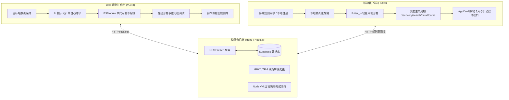

# FluxForge 跨端系统架构与多端设计规范

> 版本：v2.0  
> 适用：Web 管理工作台 / Hono 后端微服务 / Flutter 跨端移动应用

---

## 目录
- [一、 系统整体拓扑与工程体系](#一-系统整体拓扑与工程体系)
- [二、 多端职责分工与数据流转](#二-多端职责分工与数据流转)
- [三、 移动端 UI/UX 设计系统哲学](#三-移动端-uiux-设计系统哲学)
  - [3.1 AppCard 质感卡片设计规范](#31-appcard-质感卡片设计规范)
  - [3.2 浅色与深色（双模）主题色彩系统](#32-浅色与深色双模主题色彩系统)
  - [3.3 媒体详情聚合路由分发机制](#33-媒体详情聚合路由分发机制)
- [四、 服务端 API 通信契约](#四-服务端-api-通信契约)
  - [4.1 规则管理接口 (`/api/rules`)](#41-规则管理接口-apirules)
  - [4.2 云端沙箱执行接口 (`/api/rules/run`)](#42-云端沙箱执行接口-apirulesrun)
  - [4.3 网页探测与转译接口 (`/api/rules/fetch-page`)](#43-网页探测与转译接口-apirulesfetch-page)
- [五、 Flutter 客户端规则运行架构 (`RuleEngine`)](#五-flutter-客户端规则运行架构-ruleengine)
  - [5.1 运行沙箱与注入机制](#51-运行沙箱与注入机制)
  - [5.2 语法转译机制 (ESM to Executable Function)](#52-语法转译机制-esm-to-executable-function)
  - [5.3 数据缓存与离线存储](#53-数据缓存与离线存储)
- [六、 演进记录与去兼容化设计](#六-演进记录与去兼容化设计)

---

## 一、 系统整体拓扑与工程体系

FluxForge 采用统一的大仓（Monorepo）工程体系组织跨端业务：

```text
fluxforge/
├── app/                  # [Flutter] 跨端移动客户端 (iOS / Android / Desktop)
│   ├── lib/
│   │   ├── core/theme/   # 现代设计语言与质感色彩规范 (AppTheme, AppColors)
│   │   ├── models/       # 客户端领域实体模型 (Rule, DetailResult, MediaItem)
│   │   ├── services/     # 本地规则执行引擎 (RuleEngine, JS沙箱注入)
│   │   ├── views/        # 各媒体视口、规则管理与工作台页面
│   │   └── widgets/      # 核心 UI 原子组件 (AppCard, EmptyState, LoadingIndicator)
│   └── assets/           # 内置离线依赖 (axios.min.js, cheerio.js, adblock filters)
├── server/               # [Node.js / Hono] 云端微服务与远程调试沙箱
│   ├── src/db/           # 数据持久化层 (Supabase / SQLite)
│   ├── src/services/     # Node VM 沙箱执行引擎、网页编码探测服务
│   └── src/routes/       # 规则 CRUD 与调试执行 RESTful 路由
├── web/                  # [Vue 3 / Vite] 现代中台管理与规则智能工作台
│   ├── src/types/        # 全局统一类型契约定义 (rule.ts)
│   ├── src/views/rules/  # 规则开发、沙箱多维测试、AI 自动推导工作台
│   └── src/views/media/  # 跨媒体聚合详情浏览视口 (视频、画廊、小说阅读器)
├── docs/                 # 技术规范、生命周期契约与架构设计白皮书
└── package.json          # 根目录工作区统一配置
```

### 系统数据流拓扑图



---

## 二、 多端职责分工与数据流转

| 系统层级 | 技术栈 | 核心职责 |
| :--- | :--- | :--- |
| **Web 管理端** | Vue 3 + Naive UI + TailwindCSS | 规则编写、AI 智能辅助、网页 DOM 采样、沙箱热调试、规则云端同步 |
| **Server 服务端** | Hono + Node.js VM + Supabase | 规则数据持久化、远程脚本执行兜底、网页防爬探测与编码转换 |
| **Flutter 移动端** | Flutter 3.x + `package:material_ui` | 本地自运行规则、离线缓存、沉浸播放器、小说章节翻页器、高清图集画廊 |

---

## 三、 移动端 UI/UX 设计系统哲学

### 3.1 AppCard 质感卡片设计规范
为打破传统纯平 UI 的单调质感，客户端全面推行拟物微光泽卡片规范（`AppCard`）：

- **双层微立体感**：
  - 外层边框采用微妙的浅层半透明边框（如浅色模式下 `Border.all(color: Colors.black.withOpacity(0.04))`，暗黑模式下 `Border.all(color: Colors.white.withOpacity(0.08))`）；
  - 底色不采用生硬的 `#FFFFFF` 纯白，而是采用带微暖/微透光感的中性面底（`#FAFBFD` / `#161B22`）。
- **复合悬浮阴影**：
  - 运用双层柔和弥散阴影（Ambient Shadow + Key Light Shadow），营造轻盈悬浮、触感分明的物理质感。
- **动态触控响应**：
  - 集成微缩放按压反馈与高精度圆角系统（默认 14px~16px 平滑连续曲率）。

### 3.2 浅色与深色（双模）主题色彩系统
- **主色调 (Primary Brand)**：采用沉稳而富有活力的 Emerald 翡翠绿系（`#10B981` / `#059669`）；
- **浅色背景 (Light Background)**：`#F8FAFC`（Slate 50），避免刺眼的纯白色底；
- **深色背景 (Dark Background)**：`#0D1117`（深空暗蓝黑），提供极佳的 OLED 纯黑省电与防眩光观影体验；
- **组件规范**：严格使用 `package:material_ui/material_ui.dart` 统一设计语言。

### 3.3 媒体详情聚合路由分发机制
客户端采用单一路由分发入口 `MediaDetailPage`，根据传入或推断出的媒体类型（`video`、`picture`、`novel`）无缝切入专属视口：
- **视频视口 (`VideoPlayerPage`)**：集成 Chewie 高性能播放器、选集芯片流、剧照流（`previews`）与相关推荐流（`related`）；
- **图集视口 (`PhotoDetailPage`)**：集成 ExtendedImage 手势缩放画廊、自适应瀑布流网格；
- **小说视口 (`NovelReaderPage`)**：沉浸式章节阅读器、目录抽屉、自定义字体与护眼主题。

---

## 四、 服务端 API 通信契约

基础路径：`/api/rules`

### 4.1 规则管理接口 (`/api/rules`)
* **`GET /api/rules`**：获取规则列表
* **`GET /api/rules/:id`**：获取单条规则详情与核心代码
* **`POST /api/rules`**：创建规则条目
* **`PUT /api/rules/:id`**：更新规则信息与核心代码
* **`DELETE /api/rules/:id`**：删除指定规则
* **`PATCH /api/rules/:id/toggle`**：切换规则启用/禁用状态

### 4.2 云端沙箱执行接口 (`/api/rules/run`)
- **请求方法**：`POST /api/rules/run`
- **载荷参数**：
  ```json
  {
    "code": "export default defineRule({ ... })",
    "action": "discovery" | "search" | "detail" | "parse",
    "params": { "page": 1, "keyword": "..." },
    "baseUrl": "https://example.com"
  }
  ```
- **响应体**：
  ```json
  {
    "result": { "items": [...], "hasMore": false },
    "logs": [{ "level": "log", "time": "17:00:00", "message": "Done" }]
  }
  ```

### 4.3 网页探测与转译接口 (`/api/rules/fetch-page`)
- **请求方法**：`POST /api/rules/fetch-page`
- **作用**：自动侦测目标站编码（GBK, GB2312, Big5），自动解码转译为标准 UTF-8 字符串供工作台与沙箱调试。

---

## 五、 Flutter 客户端规则运行架构 (`RuleEngine`)

### 5.1 运行沙箱与注入机制
Flutter 移动端通过 `flutter_js` 运行在独立的本地轻量 JavaScriptCore (iOS/macOS) / QuickJS (Android/Linux/Windows) 引擎中。
在沙箱初始化时注入：
```dart
// 注入 window, global, console 以及本地 polyfill
await _jsRuntime.evaluate('''var window = global = globalThis;''');
await _loadAsset('assets/js/axios.min.js');
await _loadAsset('assets/js/cheerio.js');
```

### 5.2 语法转译机制 (ESM to Executable Function)
移动端 JS 引擎原生不支持 ESModule 顶层 `export default` 语法。因此 `RuleEngine` 在调度前执行自适应转换：
1. 正则剥离无用的静态 `import` 语句（因为依赖已通过全局注入）；
2. 注入 `defineRule(obj)` 语法糖，将 `export default defineRule({ ... })` 转换为返回包含各个生命周期的闭包对象；
3. 执行并传入当前 `action` 与参数，异步捕获 Promise 结果并完成序列化。

### 5.3 数据缓存与离线存储
- **规则仓库持久化**：规则元数据和代码保存在移动端本地 SQLite 数据库；
- **断网容灾**：在无网络环境下，客户端依然能载入已有规则与浏览本地缓存的媒体条目。

---

## 六、 演进记录与去兼容化设计

系统已于 v2.0 版本彻底完成架构重构与历史包袱出清：

| 历史过时模式 | 现行统一标准 | 重构说明 |
| :--- | :--- | :--- |
| `discoveryCode` / `searchCode` / `detailCode` | **单一 `code`** | 彻底弃用分散碎片代码，由 `defineRule` 单脚本承载全生命周期 |
| `list` / `data` / `results` | **`items`** | 列表与详情子资源全链路统一为 `items` |
| `episodes` / `chapters` / `images` | **`items`** | 核心消费资源大一统，去冗余、消除类型分裂 |
| `items: [{ title, url, cover }]` | **`items: [{ title, url }]`** | 移除了子条目内嵌无意义的 `cover` 字段，图片类型直接取 `url` |
| `recommendations` (长字段) | **`related`** | 采用更简短规范的 `related`，与 `MediaItem` 完美对齐 |
| 剧照与画廊图无独立字段 | **`previews`** | 独立为大图字符串数组 `previews?: string[]`，职责明确 |
| `path` / `src` / `href` / `key` | **`url`** | 彻底消除跳转别名歧义，全局统一为 `url` |
